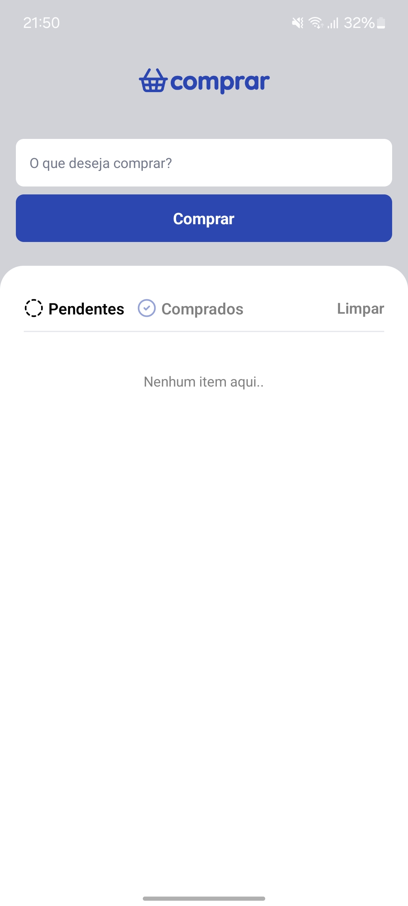

# app-comprar

Este é um aplicativo desenvolvido em React Native (TypeScript) para facilitar o gerenciamento de itens a serem comprados, com funcionalidades de filtro, status e armazenamento local.

> Projeto desenvolvido durante uma aula da formação em React Native da [Rocketseat](https://www.rocketseat.com.br/).

## Preview

<p>
  
  
</p>

## Funcionalidades
- Listagem de itens para comprar
- Adição, remoção e edição de itens
- Filtros por status dos itens (comprado, pendente, etc.)
- Interface moderna e responsiva
- Armazenamento local dos itens

## Estrutura do Projeto
```
app.json
index.ts
package.json
tsconfig.json
assets/
src/
  app/
    Home/
    assets/
    components/
    storage/
    types/
```

## Instalação
1. Clone o repositório:
   ```sh
   git clone https://github.com/dev-raullopes/app-comprar.git
   ```
2. Instale as dependências:
   ```sh
   npm install
   ```
3. Execute o app:
   ```sh
   npm start
   ```

## Scripts
- `npm start`: Inicia o projeto
- `npm run android`: Executa no Android
- `npm run ios`: Executa no iOS (MacOS)

## Tecnologias Utilizadas
- React Native
- TypeScript
- Expo

## Estrutura de Pastas
- `src/app/components`: Componentes reutilizáveis (Button, Filter, Input, Item, StatusIcon)
- `src/app/Home`: Tela principal
- `src/app/storage`: Lógica de armazenamento local
- `src/app/types`: Tipos TypeScript

## Contribuição
Pull requests são bem-vindos! Para grandes mudanças, abra uma issue primeiro para discutir o que você gostaria de mudar.

## Licença
[MIT](LICENSE)
